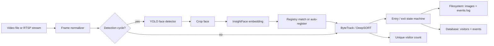

# Intelligent Face Tracker with Auto-Registration and Visitor Counting

A clean, Apple-inspired light-theme product presentation for the hackathon submission. This repository includes a polished frontend that explains the full system, the backend architecture blueprint, sample config, sample outputs, compute estimates, and the documentation required for review.

## 🎨 Frontend Design

The web interface follows Apple's design language:
- **Light background** with subtle gray gradients
- **Clean typography** using SF Pro Display system fonts
- **Minimal shadows** and borders for depth
- **Smooth animations** with Framer Motion
- **Interactive elements** like the detection skip slider
- **Tabbed interfaces** for config and schema views

## What the system does

- Detects faces from a video file during development and from RTSP in the interview.
- Uses a YOLO-based detector for real-time face detection.
- Generates embeddings with InsightFace or ArcFace for recognition.
- Auto-registers unknown visitors on first detection with a unique ID.
- Tracks people across frames with ByteTrack or DeepSORT.
- Logs exactly one entry and one exit event per visitor.
- Stores cropped images on disk and event metadata in a database.
- Maintains a unique visitor count that does not increase on re-identification.

## AI Planning Document

1. Define the event contract first: entry, recognition, tracking update, exit, and unique count.
2. Split the pipeline into detection, embedding, tracking, persistence, and audit logging.
3. Use detection skipping from `config.json` to control compute load.
4. Make the visitor registry idempotent so the same face is never double-counted.
5. Persist both the first entry crop and the final exit crop for every visitor.
6. Keep the runtime resilient so a restart can recover state from the database and log files.

## Architecture Diagram



## Backend Logic

The backend is designed around a stable state machine rather than a per-frame counter.

- `unseen`: a face has not yet been matched to an existing visitor.
- `registered`: the face is newly enrolled and assigned a unique visitor ID.
- `inside`: the visitor is confirmed in the frame and tracked by a persistent track ID.
- `lost`: the track has disappeared, but the grace period has not expired yet.
- `exited`: the exit event has been written exactly once.

### Matching strategy

- Use YOLO to detect faces only on configured skip cycles.
- Crop each face and generate an embedding with InsightFace.
- Compare against stored embeddings using cosine similarity.
- If no match crosses the threshold, auto-register the face.
- Store the embedding, timestamp, track ID, and image path in the database.

### Counting strategy

- Increment the unique visitor count only when a brand new visitor ID is created.
- Do not increment the count when the same person is re-identified in later frames.
- Use the database as the source of truth for total unique visitors.

### Logging strategy

- Write `events.log` for all major system events.
- Store cropped entry images in `logs/entries/YYYY-MM-DD/`.
- Store cropped exit images in `logs/exits/YYYY-MM-DD/`.
- Keep database writes idempotent with unique constraints on the event contract.

## Sample `config.json`

```json
{
  "input_source": "sample_video.mp4",
  "rtsp_fallback": "rtsp://camera/stream",
  "detection_skip_frames": 4,
  "detector": {
    "model": "yolov8n-face.pt",
    "confidence_threshold": 0.45,
    "iou_threshold": 0.5
  },
  "recognizer": {
    "model": "InsightFace / ArcFace",
    "similarity_threshold": 0.42,
    "register_on_first_seen": true
  },
  "tracker": {
    "algorithm": "ByteTrack",
    "max_lost_frames": 18
  },
  "storage": {
    "db": "sqlite:///visitors.sqlite",
    "logs_dir": "logs/"
  }
}
```

## Sample Outputs

Illustrative sample outputs are included in `sample-output/`.

- `sample-output/events.log` shows entry, recognition, and exit events.
- `sample-output/visitor_events.json` shows the database rows.
- `public/sample-output/` contains synthetic example images for entry and exit events.

## Setup Instructions

### Frontend

```bash
npm install
npm run dev
```

### Backend (FastAPI, local)
```bash
# From the repo root:
python -m venv .venv
./venv/Scripts/Activate.ps1  # Windows (PowerShell)
pip install -r backend/requirements.txt
uvicorn backend.server:app --host 127.0.0.1 --port 7860 --reload
```

The frontend expects `VITE_API_URL` to point to your backend (see `.env.example`).

### Direct Pipeline (Local)
```powershell
./run_direct_pipeline.ps1
```

Use Python 3.11+ with the following packages:

- `opencv-python`
- `numpy`
- `ultralytics`
- `insightface`
- `onnxruntime-gpu` or `onnxruntime`
- `sqlalchemy`
- `pydantic`
- `python-json-logger`

Recommended backend entry point structure:

```text
backend/
  main.py
  config.json
  detector.py
  recognizer.py
  tracker.py
  storage.py
  logger.py
  pipeline.py
```

Run the backend as a Python module:

```bash
python -m backend.main --config backend/config.json --source sample_video.mp4
```

## Assumptions

- The development source is the provided sample video file.
- The interview source is an RTSP stream.
- YOLO face detection can be swapped for a face-specific checkpoint without changing the pipeline contract.
- SQLite is enough for the hackathon demo, while PostgreSQL is a good upgrade path.
- A face crop can be reused as the registration reference image.
- The exit event is emitted only after the tracker has lost the face for the configured grace period.

## Compute Estimate

### CPU mode

- Good for demo video playback.
- Use a detection skip of 4 to 6 frames.
- Keep the input resolution modest to stay responsive.

### GPU mode

- Recommended for RTSP interview testing.
- YOLO and InsightFace should run on CUDA.
- Tracking and persistence stay on CPU and remain lightweight.

### Load control notes

- Skip-frame detection dramatically reduces detector cost.
- Embedding generation only happens on new or uncertain faces.
- Stable tracks are updated by the tracker instead of recomputing identity every frame.

## Loom or YouTube Video

Add your demonstration link here before submission:

- Video link: `PLACEHOLDER_FOR_LOOM_OR_YOUTUBE_LINK`

## Deliverables Checklist

- Frontend explanation of the full system.
- Sample configuration structure.
- Planning document.
- Architecture diagram.
- Logging and storage strategy.
- Compute estimate.
- Sample outputs.

This project is a part of a hackathon run by https://katomaran.com